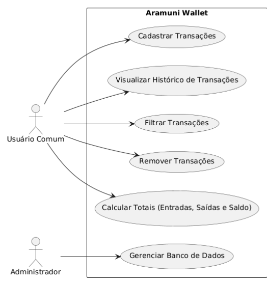

 

**Documentação de Projeto**

**para o sistema**

**Aramuni Wallet**  

**Versão 1.0** 

Projeto de sistema elaborado pelo(s) aluno(s) Ana Luiza Rezende, Gustavo Costa Gabrich e Luidi Cadete Silva  
como parte da disciplina **Projeto de Software**.

**29/11/2024**

**Tabela de Conteúdo**

**[1\. Introdução	1](#introdução)**

[**2\. Modelos de Usuário e Requisitos	1**](#modelos-de-usuário-e-requisitos)

[2.1 Descrição de Atores	1](#descrição-de-atores)

[2.2 Modelo de Casos de Uso	2](#modelo-de-casos-de-uso)

[2.3 Diagrama de Sequência do Sistema	3](#diagrama-de-sequência-do-sistema)

[**3\. Modelos de Projeto	5**](#modelos-de-projeto)

[3.1 Arquitetura	5](#arquitetura)

[3.2 Diagrama de Componentes e Implantação.	6](#diagrama-de-componentes-e-implantação.)

[3.3 Diagrama de Classes	6](#diagrama-de-classes)

[3.4 Diagramas de Sequência	8](#diagramas-de-sequência)

[3.5 Diagramas de Comunicação	8](#diagramas-de-comunicação)

[3.6 Diagramas de Estados	10](#diagramas-de-estados)

[**4\. Modelos de Dados	10**](#modelos-de-dados)

1. # **Introdução** {#introdução}

Este documento compila as diretrizes e especificações do projeto Aramuni Wallet, uma aplicação web dedicada ao controle financeiro, tanto pessoal quanto profissional. O objetivo do projeto é oferecer uma solução prática e eficiente para gerenciar finanças, promovendo a organização de receitas e despesas e incentivando a educação financeira.

O Aramuni Wallet nasceu da crescente necessidade de conscientização financeira no Brasil, onde frequentemente se negligencia o planejamento e o controle dos recursos. Com funcionalidades intuitivas e acessíveis, o sistema permite que os usuários registrem, acompanhem e analisem suas transações financeiras, ajudando-os a tomar decisões mais conscientes e responsáveis.

Construído com uma arquitetura robusta e tecnologias modernas, o sistema foi projetado para proporcionar uma experiência confiável e fluida. A interface, desenvolvida em JavaScript, é dinâmica e fácil de usar, enquanto o backend em PHP gerencia a lógica de negócios e assegura uma integração eficiente com o banco de dados MySQL. A persistência dos dados é garantida pelo uso do phpMyAdmin, facilitando a administração e armazenamento seguro das informações.

Ao longo deste documento, serão apresentados os modelos de domínio, os requisitos e os detalhes técnicos que sustentam o projeto, incluindo descrições de atores, casos de uso, diagramas e estratégias de mapeamento de dados. Esse detalhamento visa garantir clareza no desenvolvimento, manutenção e evolução do sistema, assegurando que o Aramuni Wallet atenda plenamente às necessidades dos usuários e ajude a transformar a relação das pessoas com o dinheiro.

2. # **Modelos de Usuário e Requisitos** {#modelos-de-usuário-e-requisitos}

   1. ## **Descrição de Atores** {#descrição-de-atores}

No sistema **Aramuni Wallet**, os seguintes atores interagem diretamente com a aplicação:

1. **Usuário Comum**  
   * **Descrição**: Indivíduo que utiliza o sistema para gerenciar suas finanças pessoais ou profissionais. Este é o principal ator do sistema e responsável pelo registro, consulta e exclusão de transações financeiras.  
   * **Objetivo**: Organizar receitas e despesas, visualizar histórico financeiro, calcular saldos e tomar decisões mais conscientes sobre seus recursos financeiros.  
   * **Interações com o Sistema**:  
     * Cadastrar novas transações (entradas ou saídas).  
     * Visualizar o histórico de transações.  
     * Filtrar transações específicas por descrição.  
     * Remover transações indesejadas ou incorretas.  
     * Acompanhar os cálculos automáticos de entradas, saídas e saldo total.  
2. **Administrador do Sistema** (Opcional, caso seja implementado no futuro)  
   * **Descrição**: Responsável por gerenciar e supervisionar os dados armazenados no banco de dados. Pode ser um desenvolvedor ou gestor técnico.  
   * **Objetivo**: Garantir o correto funcionamento do sistema, manutenção da base de dados e resolução de possíveis problemas técnicos.  
   * **Interações com o Sistema**:  
     * Acessar o banco de dados via phpMyAdmin para verificar, corrigir ou atualizar informações.  
     * Monitorar a integridade e segurança dos dados armazenados.  
     * Implementar melhorias ou atualizações no sistema.

Essa descrição de atores reflete os papéis principais relacionados ao **Aramuni Wallet**, possibilitando uma visão clara das interações e objetivos de cada um dentro do contexto do sistema. Caso sejam identificados novos atores, a descrição será ampliada em futuras versões deste documento.

2. ## **Modelo de Casos de Uso**  {#modelo-de-casos-de-uso}

Nesta subseção é apresentado o diagrama de casos de uso do sistema. Para cada um deles, utilize um ID que possa servir de referência no restante do documento. Por exemplo UC-01 para o Caso de Uso 01\.

3. ## **Diagrama de Sequência do Sistema** {#diagrama-de-sequência-do-sistema}

Nesta subseção é apresentado o diagrama de sequência do sistema de pelo menos, 3 Casos de Uso ou Histórias de Usuário descritos na Seção 2.3. 

Diagrama de Sequência (Cadastro de Transação)  
.png)

Diagrama de Sequência (Cálculo de Totais)

.png)

 Diagrama de Sequência (Remoção de Transação)  

.png)

Formato para cada contrato de operação

| Contrato | Cadastro de Transação |
| :---- | :---- |
| **Operação** | O usuário insere uma nova transação no sistema. |
| **Referências cruzadas** | Caso de Uso: "Cadastrar Transações" (UC1). |
| **Pré-condições** | O usuário deve estar na interface de cadastro de transações. Os campos obrigatórios devem estar preenchidos corretamente. |
| **Pós-condições** | A transação é salva no banco de dados e exibida no histórico de transações. O saldo total é atualizado automaticamente. |

Formato para cada contrato de operação

| Contrato | Visualizar Histórico de Transações |
| :---- | :---- |
| **Operação** | O usuário solicita a exibição de todas as transações cadastradas. |
| **Referências cruzadas** | Caso de Uso: "Visualizar Histórico de Transações" (UC2). |
| **Pré-condições** | Deve haver transações previamente cadastradas no sistema. |
| **Pós-condições** | As transações são exibidas na tabela do histórico em ordem cronológica. |

Formato para cada contrato de operação

| Contrato | Remover Transação |
| :---- | :---- |
| **Operação** | O usuário solicita a exclusão de uma transação específica. |
| **Referências cruzadas** | Caso de Uso: "Remover Transações" (UC4). |
| **Pré-condições** | O sistema deve exibir a lista de transações e o usuário deve selecionar uma transação válida. |
| **Pós-condições** | A transação é removida do banco de dados e a interface é atualizada. O saldo total é recalculado. |

# 

3. # **Modelos de Projeto** {#modelos-de-projeto}

   1. ## **Arquitetura**  {#arquitetura}

2. ## **Diagrama de Componentes e Implantação.** {#diagrama-de-componentes-e-implantação.}

3. ## **Diagrama de Classes** {#diagrama-de-classes}

4. ## **Diagramas de Sequência** {#diagramas-de-sequência}

5. ## **Diagramas de Comunicação** {#diagramas-de-comunicação}

Diagramas de comunicação para realização de casos de uso.  

6. ## **Diagramas de Estados** {#diagramas-de-estados}

4. # **Modelos de Dados** {#modelos-de-dados}

Deve-se apresentar os esquemas de banco de dados e as estratégias de mapeamento entre as representações de objetos e não-objetos. 

